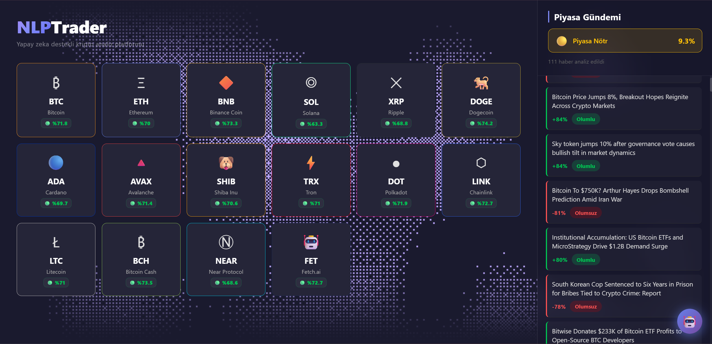
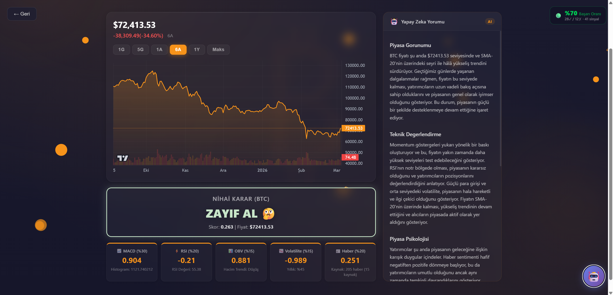
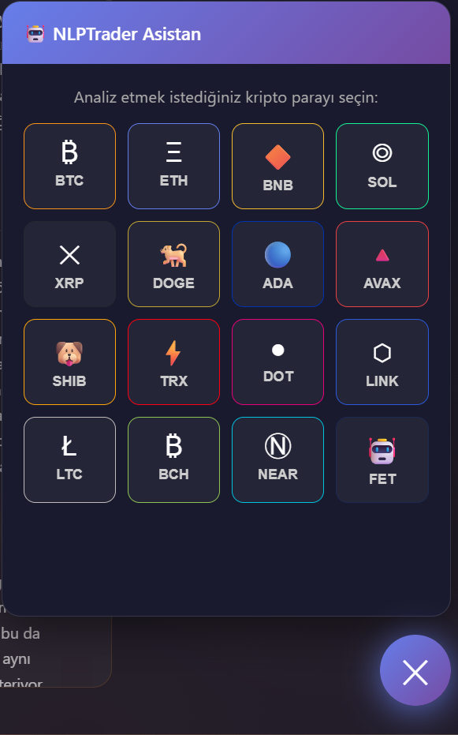
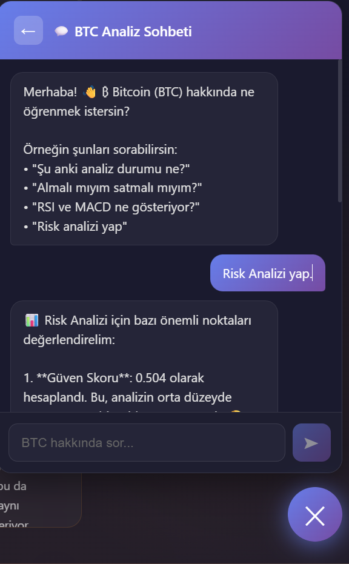

# 🧠 NLPTrader — Yapay Zeka Destekli Kripto Analiz Platformu

<p align="center">
  <a href="https://fastapi.tiangolo.com/">
    
  </a>
  <a href="https://react.dev/">
    
  </a>
  <a href="https://vitejs.dev/">
    
  </a>
  <a href="https://groq.com/">
    
  </a>
  <a href="https://supabase.com/">
    
  </a>
  <a href="https://threejs.org/">
    
  </a>
</p>

<p align="center">
  <a href="https://nlp-trader.vercel.app/">
    
  </a>
</p>

> Kripto para piyasalarını **teknik analiz, NLP haber duygu analizi ve yapay zeka** ile birleştirerek yorumlayan, her analize sinyal kaydı tutup geçmiş başarısını ölçen akıllı trading platformu.
>
> 🌐 **Canlı Demo**: [https://nlp-trader.vercel.app](https://nlp-trader.vercel.app/)

---

## 📋 Proje Hakkında

**NLPTrader**, kripto para yatırımcılarının daha bilinçli kararlar almasını sağlayan yapay zeka destekli bir analiz platformudur.

Piyasadaki bir coin'i analiz ettiğinizde sistem sadece RSI veya MACD gibi teknik göstergelere bakmaz. Aynı anda **15 farklı haber kaynağından** yüzlerce haberi çekip VADER + özel kripto sözlüğü ile duygu analizi yapar, 5 farklı indikatörü **Non-Linear Tanh fonksiyonu** ile normalize edip **Multi-Factor Decision Tree** ile birleştirir ve size 7 kademeli bir AL/SAT/BEKLE kararı sunar.

Sistem her analiz çağrısında **Supabase veritabanına sinyal kaydı** yapar. Bir sonraki analizde fiyat yükselmişse → "BAŞARILI", düşmüşse → "BAŞARISIZ" olarak işaretlenir. Böylece sistemin geçmiş performansı şeffaf şekilde izlenebilir.

- **Frontend**: React 19 + Vite 7 + React Router DOM + Three.js (WebGL)
- **Backend**: FastAPI + Python + Uvicorn
- **NLP**: VADER Sentiment Analysis + 135+ Kripto Özel Sözlük
- **Teknik Analiz**: RSI, MACD, OBV, Z-Score, Volatilite (ta kütüphanesi + yfinance)
- **Yapay Zeka**: Groq API — LLaMA 3.3 70B Versatile (Chatbot + Yorum)
- **Veritabanı**: Supabase (PostgreSQL — Sinyal Takip Sistemi)
- **Grafik**: TradingView Lightweight Charts
- **Deploy**: Vercel (Frontend) + Render (Backend)

---

## 🖼️ Ekran Görüntüleri

### 1. Ana Sayfa — Kripto Dashboard

Sol panelde 16 kripto para kartı, her birinde canlı başarı oranı badge'i görünür. Sağ panelde SSE (Server-Sent Events) ile gerçek zamanlı akan haber akışı ve genel piyasa sentiment göstergesi yer alır.

<p align="center">
  <br/>
  <em>NLPTrader Ana Sayfa — Kripto Grid + Haber Paneli</em>
</p>

### 2. Coin Analiz Sayfası

Coin'e tıklandığında açılan detaylı analiz sayfası. TradingView Lightweight Charts ile profesyonel fiyat grafiği (6 farklı periyot), nihai AL/SAT/BEKLE karar kartı, 5 teknik indikatör puanı ve sağ tarafta LLaMA 3.3 70B tarafından yazılmış profesyonel piyasa yorumu.

<p align="center">
  <br/>
  <em>Coin Detay Sayfası — Grafik + Karar + İndikatörler + AI Yorum</em>
</p>

### 3. AI Chatbot — Kripto Danışmanı

Floating chatbot butonu her sayfada erişilebilir. İlk aşamada analiz edilecek coin seçilir, ardından seçilen coin'in canlı analiz verileri bağlam olarak LLM'e gönderilir. Kullanıcı Türkçe doğal dilde soru sorar ve veriye dayalı kişiselleştirilmiş yanıtlar alır.

<p align="center">
  
  
  <br/>
  <em>Chatbot — Coin Seçimi ve AI Sohbet Ekranı</em>
</p>

---

## 🧠 Yapay Zeka: Hibrit Strateji Motoru (Non-Linear Tanh + Momentum)

Bu projenin en kritik ve fark yaratan özelliği: **5 farklı veri kaynağını Tanh normalizasyonu ile birleştirip, çok faktörlü karar ağacıyla 7 kademeli sinyal üreten hibrit strateji motoru.**

### Nasıl Çalışır?

Bir coin'i analiz ettiğinizde sistem sırayla şunları yapar:

1. **Yahoo Finance'den** 6 aylık OHLCV verisini çeker
2. **RSI, MACD, OBV** teknik indikatörlerini hesaplar
3. **Z-Score** ile fiyatın ortalamadan sapmasını ölçer
4. **15 RSS kaynağından** yüzlerce haberi çekerek duygu analizi yapar
5. Tüm skorları **Tanh fonksiyonu** ile −1/+1 arasına normalize eder
6. Ağırlıklı toplam, konsensüs, güven, trend tutarlılığı ve risk/ödül hesaplar
7. **Dinamik eşiklerle** (volatiliteye göre ayarlanan) nihai kararı verir

### 5 İndikatör ve Ağırlıkları

| İndikatör | Ağırlık | Normalizasyon Yöntemi | Veri Kaynağı |
|-----------|---------|----------------------|--------------|
| **MACD** | %30 | Histogram / StdDev → `tanh()` | `ta` kütüphanesi |
| **RSI** | %20 | Tanh(50-merkez) + Momentum Bonusu (%80/%20) | `ta` kütüphanesi |
| **Sentiment** | %20 | Skor × 2 → `tanh()` | VADER + 15 RSS |
| **OBV** | %15 | 5 günlük eğim × 20 → `tanh()` | `ta` kütüphanesi |
| **Volatilite** | %15 | Mean Reversion: `−tanh(z_score)` | Rolling SMA-20 |

> **Neden Tanh?** Sigmoid benzeri bu fonksiyon, uç değerlerde sertleşme sağlar. RSI 99 ile RSI 80 arasındaki fark, RSI 55 ile RSI 50 arasındaki farktan daha az etkilidir. Bu yaklaşım, piyasalardaki azalan marjinal etki prensibini yansıtır.

### 7 Kademeli Karar Çıktısı

| Karar | Emoji | Güçlü Sinyal Koşulu | Renk |
|-------|-------|---------------------|------|
| **GÜÇLÜ AL** | 🚀 | Skor > güçlü eşik, güven > %40, trend > %60, konsensüs ≥ %60 | `#00c853` |
| **AL** | 🌱 | Skor > normal eşik, güven > %25, trend > %40 | `#69f0ae` |
| **ZAYIF AL** | 🤔 | Skor > normal×0.7, güven > %15 | `#c8e6c9` |
| **BEKLE** | 😐 | Yetersiz sinyal gücü veya tutarsız indikatörler | `#bdbdbd` |
| **ZAYIF SAT** | 🤔 | (Aynı koşullar, ters yön) | `#ffccbc` |
| **SAT** | 🔻 | (Aynı koşullar, ters yön) | `#ffab91` |
| **GÜÇLÜ SAT** | 💀 | (Aynı koşullar, ters yön) | `#d50000` |

### Gelişmiş Güven Metrikleri

Sistem sadece skora bakarak karar vermez. Her sinyal için şu metrikleri de hesaplar:

| Metrik | Açıklama |
|--------|----------|
| **Konsensüs Oranı** | 5 indikatörden kaçı aynı yönde? (0–1) |
| **Sinyal Gücü** | İndikatörlerin ortalama mutlak şiddeti |
| **Güven Skoru** | Konsensüs × Sinyal Gücü × Volatilite penaltısı |
| **Trend Tutarlılığı** | İndikatörlerin ana skorla aynı yönde olma oranı |
| **Risk/Ödül Skoru** | Z-score risk vs momentum ödül oranı |
| **Dinamik Eşikler** | Yüksek volatilitede daha temkinli eşikler otomatik devreye girer |

---

## 📰 NLP: Haber Duygu Analizi (VADER + Kripto Özel Sözlük)

Sistem, **VADER Sentiment Analyzer**'ı kripto/finans terminolojisiyle genişleterek haberlerin piyasaya etkisini ölçer.

### 135+ Kripto Özel Terim

VADER'ın standart İngilizce sözlüğü kripto dünyasını bilmez. Bu yüzden **135'ten fazla kripto/finans terimi** özel ağırlıklarıyla sözlüğe eklenmiştir:

| Kategori | Örnek Terimler | Skor Aralığı |
|----------|---------------|--------------|
| **Güçlü Pozitif** | `bullish`, `surge`, `rally`, `breakout`, `all-time high`, `moon` | +2.5 → +3.2 |
| **Orta Pozitif** | `gain`, `rise`, `recovery`, `adoption`, `approved`, `etf`, `halving` | +1.3 → +2.5 |
| **Güçlü Negatif** | `bearish`, `crash`, `dump`, `collapse`, `scam`, `hack`, `rug pull` | −2.5 → −3.5 |
| **Orta Negatif** | `drop`, `fall`, `sell-off`, `ban`, `crackdown`, `lawsuit`, `panic` | −0.8 → −2.5 |

### 15 RSS Haber Kaynağı

| Kaynak | Odak |
|--------|------|
| CoinTelegraph (Genel + BTC + ETH + Altcoin) | Kripto |
| CoinDesk | Kripto |
| CryptoNews | Kripto |
| Decrypt | Kripto |
| Bitcoin Magazine | Bitcoin |
| NewsBTC | Kripto |
| U.Today | Kripto |
| CryptoPotato | Kripto |
| The Block | Kripto |
| CryptoBriefing | Kripto |
| Investing.com | Finans |
| Bloomberg Crypto | Finans |

### İki Haber Modu

1. **Toplu Çekme** (`get_sentiment_data()`): Son 24 saatin tüm haberlerini çeker, duplicate'ları filtreler, ortalama sentiment skoru hesaplar
2. **Gerçek Zamanlı Stream** (`stream_news_data()`): Haberleri tek tek **SSE (Server-Sent Events)** ile frontend'e stream eder — kullanıcı her haberi anında görür

---

## 🗃️ Supabase Sinyal Takip Sistemi — Kıyaslamalı Başarı

Sistem, ürettiği sinyallerin performansını geçmiş verilerle karşılaştırarak ölçer.

### Veritabanı Tabloları

| Tablo | Alanlar | Açıklama |
|-------|---------|----------|
| `crypto_coins` | `coin_id`, `symbol`, `name` | 16 kripto para tanımı |
| `trade_signals` | `signal_id`, `coin_id`, `entry_price`, `is_successful`, `signal_date` | Sinyal geçmişi |

### Çalışma Mantığı

Her `/fiyat/{sembol}` çağrısında otomatik olarak:

1. **Önceki NULL kaydı** bul (henüz sonuçlanmamış sinyal)
2. **Güncel fiyat > Eski fiyat** → `is_successful = 1` (Başarılı ✓)
3. **Güncel fiyat ≤ Eski fiyat** → `is_successful = 0` (Başarısız ✗)
4. **Yeni kayıt** ekle (`is_successful = NULL` — sonucu belli değil)

Bu sayede her analiz çağrısı aynı zamanda bir sinyal kaydıdır ve bir sonraki çağrıda değerlendirilir.

### Akış Diyagramı

Aşağıdaki diyagram, sinyal takip sisteminin çalışma mantığını adım adım gösterir. İlk ziyarette yeni kayıt NULL olarak eklenir, ikinci ziyarette fiyat karşılaştırması yapılarak önceki kaydın başarı durumu güncellenir:

<p align="center">
  <br/>
  <em>Supabase Sinyal Takip Sistemi — Kıyaslamalı Başarı Akış Diyagramı</em>
</p>

### Başarı Oranı Gösterimi

- **Ana sayfada**: Her coin kartında renkli badge (🟢 ≥%60, 🟡 ≥%40, 🔴 <%40)
- **Coin detay sayfasında**: Detaylı istatistik — başarılı✓ / başarısız✗ / toplam sinyal sayısı

---

## 🤖 AI Chatbot — Kripto Danışmanı

Her sayfada erişilebilir floating chatbot, seçilen coin'in **canlı analiz verilerini bağlam olarak** LLM'e göndererek kişiselleştirilmiş yanıtlar üretir.

### Çalışma Akışı

1. Kullanıcı 🤖 butonuna tıklar → 16 coin'den birini seçer
2. Backend, seçilen coin için hibrit strateji analizini çalıştırır
3. Analiz sonuçları (fiyat, RSI, MACD, OBV, volatilite, sentiment, güven metrikleri, dinamik eşikler) **system prompt** olarak LLM'e gönderilir
4. Kullanıcı Türkçe doğal dilde soru sorar
5. LLM, **gerçek veriye dayalı** yanıt üretir

### Bağlam Verileri (System Prompt)

Chatbot'a gönderilen analiz bağlamı şunları içerir:

- 💰 Güncel fiyat ve sembol
- 🎯 Nihai karar ve açıklama
- 📐 5 indikatör puanı (ağırlıklarıyla)
- 📊 İndikatör dağılımı (yükseliş/düşüş/nötr sayısı)
- 🔬 Ham veriler (RSI değeri, MACD histogram, OBV eğimi, Z-Score, volatilite)
- 🛡️ Güven metrikleri (konsensüs, sinyal gücü, trend tutarlılığı)
- ⚙️ Dinamik eşikler

**Kullanılan Model**: Groq API — LLaMA 3.3 70B Versatile

---

## 📝 AI Piyasa Yorumu — Profesyonel Analiz Raporu

Coin detay sayfasında LLaMA 3.3 70B, yapılandırılmış ve profesyonel bir piyasa raporu üretir.

### Yorum Yapısı (5 Bölüm)

| Bölüm | İçerik |
|-------|--------|
| **Piyasa Görünümü** | Genel durum, fiyatın nerede olduğu, trendin yönü |
| **Teknik Değerlendirme** | Göstergelerin ne anlattığını YORUMLAMA — ham sayı yok |
| **Piyasa Psikolojisi** | Yatırımcılar ne düşünüyor? Korku mu açgözlülük mü? |
| **Kritik Seviyeler ve Senaryolar** | İki farklı senaryo sunma |
| **Strateji Önerisi** | Ne yapılmalı + yatırım tavsiyesi değildir uyarısı |

### Kritik Kurallar

- ❌ Ham sayıları doğrudan yazmak **YASAK** ("MACD puanı 0.455" gibi)
- ✅ Verilerin **ne anlama geldiğini** açıklamak gerekli ("Momentum göstergeleri yukarı yönlü baskı oluşturuyor")
- Piyasa psikolojisi, tarihsel bağlam ve somut senaryolar sunulmalı
- Markdown formatında yapılandırılmış çıktı

---

## 📈 Desteklenen Kripto Paralar (16 Adet)

| Sembol | Ad | İkon | Renk |
|--------|----|------|------|
| BTC | Bitcoin | ₿ | `#f7931a` |
| ETH | Ethereum | Ξ | `#627eea` |
| BNB | Binance Coin | 🔶 | `#f3ba2f` |
| SOL | Solana | ◎ | `#14f195` |
| XRP | Ripple | ✕ | `#23292f` |
| DOGE | Dogecoin | 🐕 | `#c2a633` |
| ADA | Cardano | 🔵 | `#0033ad` |
| AVAX | Avalanche | 🔺 | `#e84142` |
| SHIB | Shiba Inu | 🐶 | `#ffa409` |
| TRX | Tron | ⚡ | `#ff0013` |
| DOT | Polkadot | ● | `#e6007a` |
| LINK | Chainlink | ⬡ | `#2a5ada` |
| LTC | Litecoin | Ł | `#bfbbbb` |
| BCH | Bitcoin Cash | ₿ | `#8dc351` |
| NEAR | Near Protocol | Ⓝ | `#00c1de` |
| FET | Fetch.ai | 🤖 | `#1d2951` |

---

## 📊 TradingView Fiyat Grafiği

**TradingView Lightweight Charts** kütüphanesi ile profesyonel fiyat grafiği:

- **Area Chart**: Coin renginde çizgi + gradyan dolgu
- **Volume Histogram**: Alış (coin rengi) / Satış (kırmızı) ayrımı
- **6 Periyot**: 1 Gün, 5 Gün, 1 Ay, 6 Ay, 1 Yıl, Maksimum
- **Crosshair**: Coin renginde hassas fiyat/tarih göstergesi
- **Fiyat Header**: Güncel fiyat, değişim miktarı ve yüzde

---

## 🌐 Canlı Haber Akışı (Server-Sent Events)

Ana sayfanın sağ panelinde haberler **SSE (Server-Sent Events)** ile gerçek zamanlı olarak akar:

1. Backend, 15 RSS kaynağından haberleri çeker
2. Her haber tek tek VADER + Kripto sözlüğü ile analiz edilir
3. Haberin skoru ve durumu (Olumlu/Olumsuz/Nötr) ile birlikte frontend'e stream edilir
4. Frontend, haberleri skora göre sıralar ve renkli border ile gösterir
5. Genel piyasa sentiment ortalaması badge olarak gösterilir (🟢 Pozitif / 🟡 Nötr / 🔴 Negatif)

---

## 🛠️ Kullanılan Teknolojiler

### Frontend

| Teknoloji | Sürüm | Açıklama |
|-----------|-------|----------|
| **React** | 19.2.0 | Kullanıcı arayüzü framework'ü |
| **Vite** | 7.2.4 | Hızlı build ve dev server |
| **React Router DOM** | 7.12.0 | SPA sayfa yönlendirme |
| **Lightweight Charts** | 5.1.0 | TradingView fiyat grafikleri |
| **CSS3 Animasyonlar** | — | Glow, float, fade, glassmorphism |

### Backend

| Teknoloji | Açıklama |
|-----------|----------|
| **FastAPI** | Modern Python web framework |
| **Uvicorn** | ASGI server |
| **yfinance** | Yahoo Finance kripto fiyat verileri |
| **ta** (Technical Analysis) | RSI, MACD, OBV teknik indikatörler |
| **NumPy** | Tanh normalizasyon ve hesaplamalar |
| **python-dotenv** | Çevre değişkenleri yönetimi |

### NLP & AI

| Teknoloji | Açıklama |
|-----------|----------|
| **VADER Sentiment** | Duygu analizi motoru |
| **feedparser** | RSS haber çekme |
| **Groq API** | LLaMA 3.3 70B Versatile dil modeli |

### Veritabanı & Deploy

| Servis | Açıklama |
|--------|----------|
| **Supabase** | PostgreSQL — Sinyal takip sistemi |
| **Vercel** | Frontend deploy (SPA rewrite) |
| **Render** | Backend deploy (Free tier) |

---

## 🚀 Kurulum

### Gereksinimler

- **Python** (3.10+)
- **Node.js** (v18+)
- **Groq API Key** (chatbot + AI yorum için)
- **Supabase Hesabı** (sinyal takip sistemi için)

### 1) Depoyu Klonlayın

```bash
git clone https://github.com/BurakYucelPY/NLPTrader.git
cd NLPTrader
```

### 2) Backend Kurulumu

```bash
cd ai-backend

# Sanal ortam oluştur
python -m venv venv

# Windows
venv\Scripts\activate

# Gerekli paketleri yükle
pip install -r requirements.txt

# .env dosyası oluştur
# GROQ_API_KEY=your_groq_api_key
# SUPABASE_URL=your_supabase_url
# SUPABASE_KEY=your_supabase_key

# Backend'i başlat
uvicorn main:app --reload --port 8000
```

Backend `http://localhost:8000` adresinde çalışacaktır.

### 3) Frontend Kurulumu

```bash
cd frontend

# Bağımlılıkları yükle
npm install

# Development sunucusunu başlat
npm run dev
```

Frontend `http://localhost:5173` adresinde çalışacaktır.

### 4) Supabase Veritabanı Kurulumu

Supabase'de aşağıdaki iki tabloyu oluşturun:

```sql
-- Kripto paralar tablosu
CREATE TABLE crypto_coins (
    coin_id SERIAL PRIMARY KEY,
    symbol VARCHAR(10) NOT NULL,
    name VARCHAR(50) NOT NULL
);

-- Sinyal takip tablosu
CREATE TABLE trade_signals (
    signal_id SERIAL PRIMARY KEY,
    coin_id INTEGER REFERENCES crypto_coins(coin_id),
    entry_price DECIMAL NOT NULL,
    is_successful INTEGER,  -- NULL: bekliyor, 1: başarılı, 0: başarısız
    signal_date TIMESTAMP NOT NULL
);
```

---

## 📡 API Endpoint'leri

| Endpoint | Metod | Açıklama |
|----------|-------|----------|
| `/health` | GET | Sunucu sağlık kontrolü |
| `/piyasa-durumu` | GET | Tüm haberler + sentiment sonuçları |
| `/piyasa-durumu-stream` | GET | SSE ile gerçek zamanlı haber akışı |
| `/fiyat/{sembol}` | GET | Hibrit strateji analizi + sinyal kaydı |
| `/grafik/{sembol}?periyot=6mo` | GET | Geçmiş fiyat verileri (OHLCV) |
| `/yorum/{sembol}` | GET | AI tarafından yazılmış piyasa raporu |
| `/chatbot` | POST | Groq LLM ile bağlamlı sohbet |
| `/basari-orani/{sembol}` | GET | Tek coin başarı istatistikleri |
| `/basari-ozet` | GET | Tüm coinlerin başarı oranları (toplu) |

---

## 📁 Proje Yapısı

```
NLPTrader/
├── ai-backend/
│   ├── main.py                          # FastAPI uygulama giriş noktası (7 endpoint)
│   ├── requirements.txt                 # Python bağımlılıkları
│   ├── .env                             # API anahtarları (git'e eklenmez)
│   └── services/
│       ├── finance.py                   # Hibrit strateji motoru (Tanh + Multi-Factor)
│       ├── nlp.py                       # VADER NLP + 135 kripto terim + 15 RSS kaynak
│       ├── chatbot.py                   # Groq LLM chatbot + AI piyasa yorumu
│       └── supabase_service.py          # Sinyal takip + başarı oranı hesaplama
├── frontend/
│   ├── index.html                       # HTML giriş noktası
│   ├── package.json                     # Node.js bağımlılıkları
│   ├── vite.config.js                   # Vite yapılandırması
│   ├── vercel.json                      # Vercel SPA rewrite kuralı
│   ├── .env.production                  # Production API URL'si
│   └── src/
│       ├── main.jsx                     # React giriş noktası (BrowserRouter)
│       ├── App.jsx                      # Ana bileşen (NewsProvider + Routes + ChatBot)
│       ├── App.css                      # Tüm stiller (1,787 satır — karanlık tema)
│       ├── index.css                    # Global resetler
│       ├── config/
│       │   └── api.js                   # Merkezi API base URL yapılandırması
│       ├── context/
│       │   └── NewsContext.jsx          # SSE haber state yönetimi (retry mekanizması)
│       ├── routes/
│       │   ├── paths.jsx                # Route sabitleri + 16 kripto para tanımları
│       │   └── AppRoutes.jsx            # React Router yapısı
│       ├── pages/
│       │   ├── HomePage.jsx             # Ana sayfa (Coin grid + Haber paneli)
│       │   └── CoinPage.jsx             # Coin detay wrapper
│       └── components/
│           ├── AnalysisTemplate.jsx      # Coin analiz sayfası ana layout'u
│           ├── PriceChart.jsx            # TradingView Lightweight Charts grafiği
│           ├── DecisionCard.jsx          # Nihai AL/SAT/BEKLE karar kartı
│           ├── AnalysisMetrics.jsx       # 5 indikatör puan kartları
│           ├── AiCommentary.jsx          # AI piyasa yorumu (markdown renderer)
│           ├── ChatBot.jsx              # Floating AI chatbot (3 durumlu)
│           ├── NewsSection.jsx           # Haber listesi (skor renkli)
│           ├── AssetCard.jsx             # Coin kartı (başarı badge'li)
│           ├── BackendWakeUp.jsx         # Render uyanma overlay'i
│           ├── BackendWakeUp.css         # Uyanma ekranı stilleri
│           ├── PixelBlast.jsx            # Three.js WebGL shader arka plan
│           └── PixelBlast.css            # PixelBlast container stili
└── ReadMeImages/                        # README ekran görüntüleri
```

---

## 💡 Nasıl Çalışır?

### 1. Sunucu Uyanma
Render free tier sunucu uyku modundayken `BackendWakeUp` bileşeni şık bir loading ekranı gösterir. `/health` endpoint'ine 3 saniye arayla ping atar, yanıt gelince 700ms fade-out ile kaybolur.

### 2. Ana Sayfa — Dashboard
Sayfa açıldığında paralel olarak iki işlem başlar: SSE ile haberler gerçek zamanlı akmaya başlar, `/basari-ozet` endpoint'inden tüm coinlerin başarı oranları çekilir. Kullanıcı 16 kripto kartını başarı oranlarıyla birlikte görür.

### 3. Coin Analizi
Coin kartına tıklandığında animasyonlu loading overlay açılır. Backend'e `/fiyat/{sembol}` isteği gider. Backend sırasıyla: Yahoo Finance'den 6 aylık veri çeker, 5 indikatörü hesaplar, Tanh ile normalize eder, multi-factor karar ağacını işletir, Supabase'e sinyal kaydı yazar ve sonucu döndürür.

### 4. Coin Detay Sayfası
Analiz sonucu ile CoinPage'e yönlendirilir. İki sütunlu dashboard'da: sol tarafta TradingView grafiği (6 periyot), nihai karar kartı ve 5 indikatör kartı; sağ tarafta LLaMA 3.3 70B'nin yazdığı profesyonel piyasa raporu görüntülenir.

### 5. AI Chatbot
Her sayfada erişilebilir floating chatbot. Önce coin seçtirir, sonra o coin'in tüm analiz verilerini (fiyat, RSI, MACD, OBV, volatilite, sentiment, güven metrikleri) system prompt olarak gönderip bağlamlı sohbet başlatır.

### 6. Sinyal Takibi
Her `/fiyat/` çağrısında Supabase'e otomatik sinyal kaydı yazılır. Bir sonraki çağrıda fiyat karşılaştırması yapılarak önceki sinyalin başarısı güncellenir. Bu veriler hem ana sayfadaki badge'lerde hem detay sayfasındaki istatistiklerde gösterilir.

---

## 🐛 Sorun Giderme

| Sorun | Çözüm |
|-------|-------|
| **Backend'e erişilemiyor** | `.env` dosyasındaki API anahtarlarını kontrol edin |
| **Haberler yüklenmiyor** | SSE bağlantısı 3 kez retry eder, internet bağlantısını kontrol edin |
| **Chatbot çalışmıyor** | `GROQ_API_KEY` tanımlı ve geçerli olduğundan emin olun |
| **Grafik verisi yok** | Yahoo Finance'den veri çekilemiyor olabilir, sembolü kontrol edin |
| **Başarı oranı görünmüyor** | Supabase tablolarının oluşturulduğundan ve coin'lerin eklendiğinden emin olun |
| **CORS hatası** | Backend'in `http://localhost:8000`'de çalıştığını doğrulayın |
| **Render uyku modu** | Free tier sunucu 15 dakika inaktiviteden sonra uyur, `BackendWakeUp` otomatik uyandırır |

---

## 📌 Notlar

- **API Anahtarları**: Groq API (chatbot + yorum) ve Supabase (sinyal takip) için API anahtarları gereklidir.
- **Yahoo Finance**: Fiyat verileri için ayrı API key gerekmez, `yfinance` kütüphanesi ücretsiz kullanılır.
- **RSS Kaynakları**: Haber çekimi için API key gerekmez, tüm RSS feedleri ücretsiz ve açıktır.
- **Deploy**: Frontend Vercel'de, Backend Render free tier'da barındırılır. Production API URL'si `frontend/.env.production` dosyasında tanımlıdır.
- **VADER Sözlük**: Kripto özel terimleri `nlp.py` dosyasında `KRIPTO_SOZLUK` dictionary'sinde tanımlıdır, kolayca genişletilebilir.

---

<p align="center">
  Made with ❤️ by
  <a href="https://github.com/BurakYucelPY">Burak Yücel</a>
</p>
